#  Projet Spring-Angular-JWT Spring Security

## Présentation du Projet
On souhaite créer une application qui permet de gérer des comptes bancaires basé sur 
un agent AI. chaque compte appartient à un client. 
- un compte peut subir plusieurs opérations de type DEBIT ou CREDIT. 
- Il existe deux types de comptes : Comptes courants et comptes épargnes.

## 1. STack technique (Spring Boot 4.1.0)
- Spring Data
- Spring Data JPA
- Hibernate 
- Spring web
- DevTools
- Spring Security
- ModelMapper (MapStruct-JMapper)
- Angular
- MySQL
- MongoDB(NoSQL)
- Swagger

## 2. Concept
- Entity
- DTOs 
- JWT
- Web & IoC containeur
- DAO
- Service
- Repository
- Rest API
- Frontend
- Backend
- JsonProperty
- SQL

## Architecture
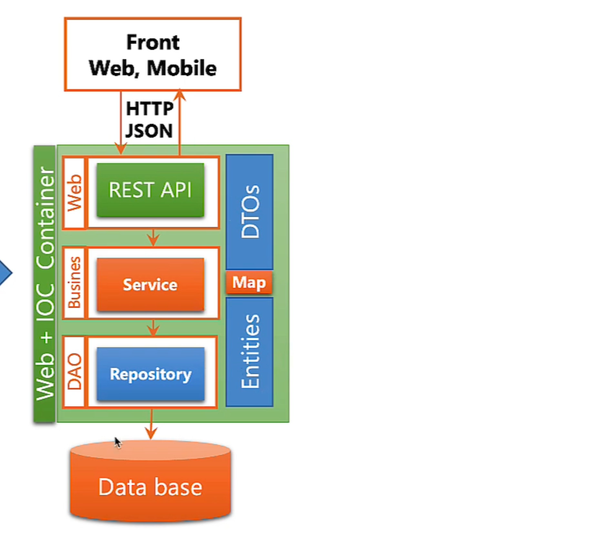

## Use Case Diagram
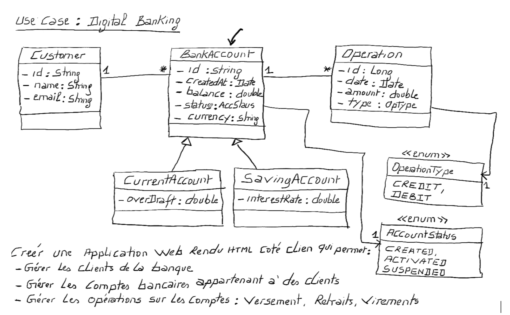

- mapping d'héritage dans les bases de données relationnelles(Single Table->Jointable->TablePerClass)
- assoiation 1 * et sens * 1
# Partie I -  Backend
####  Account and Operation details
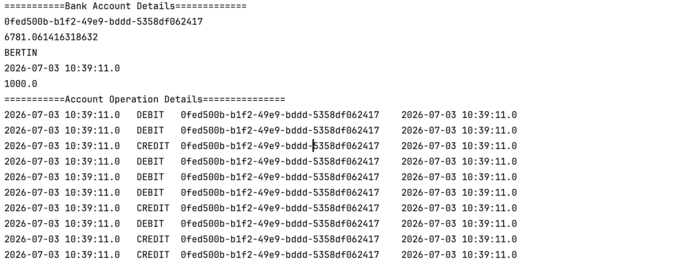

####  BankAccountService

#### web layer & Jackson cyclic reference
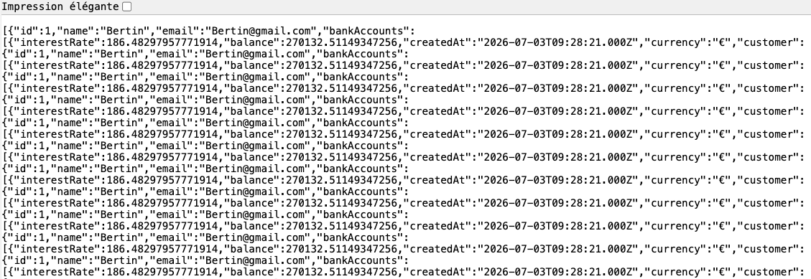
 
   @JsonProperty(access = JsonProperty.Access.WRITE_ONLY)
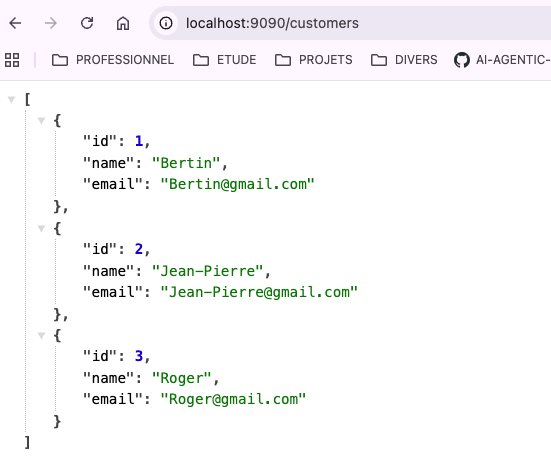

####  Customer with DTO
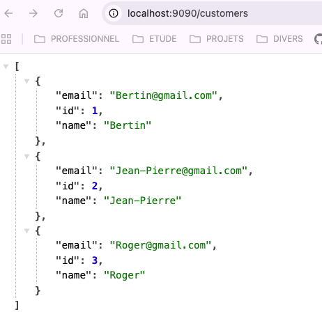

#### Swagger documentation(spring boot openapi doc maven dependency)
[http://localhost:9090/swagger-ui/index.html]
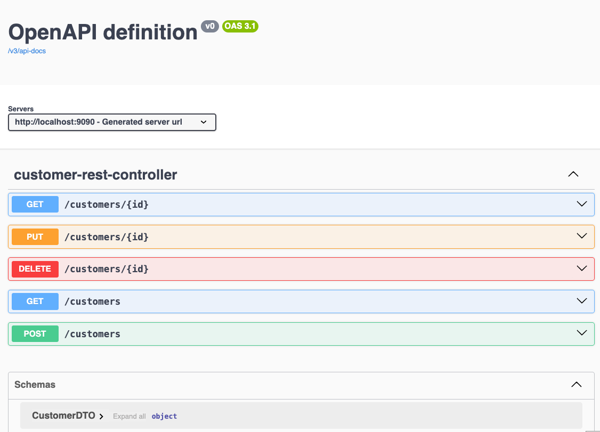

###  BankAccountRestAPI with DTO
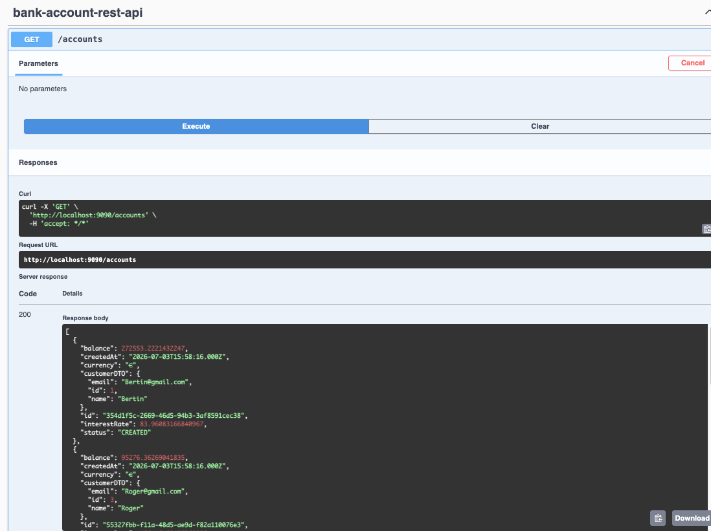

###  BankAccount Operations with DTO
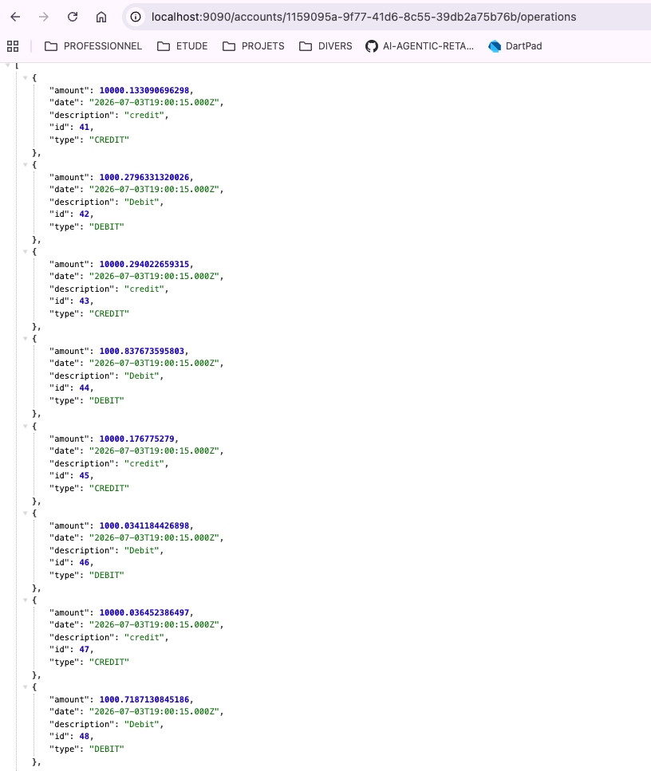

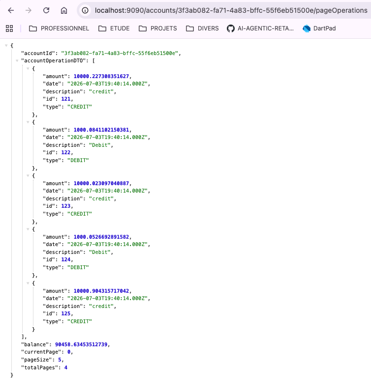

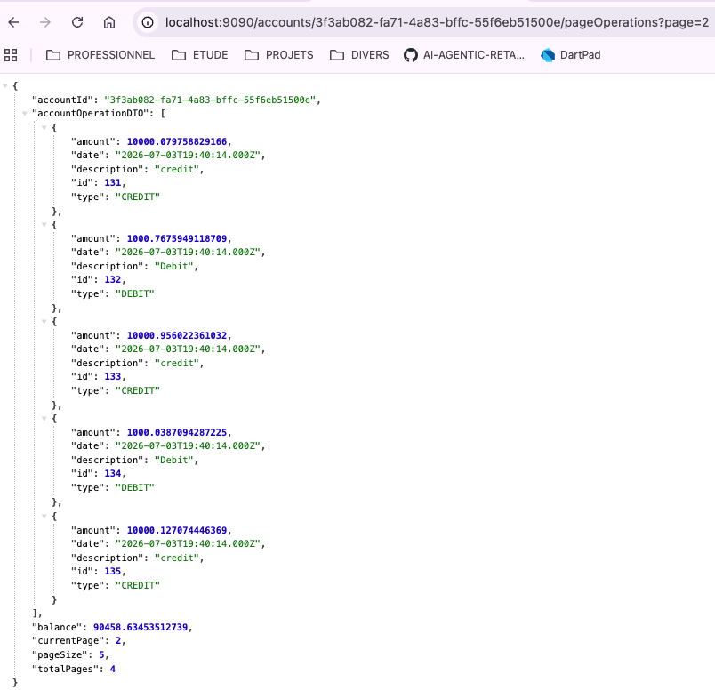

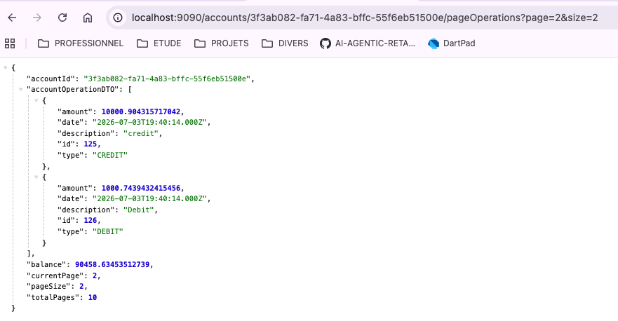

# Partie II - Client Angular (angular 21.2.18)
le client Angular représente le frontend et est disponible à partir du dépôt : 
[https://github.com/jeanpierrensem/digital-banking-web-angular21]

- CRUD
- validator 
- httpClient
- FormGroup
- CORS

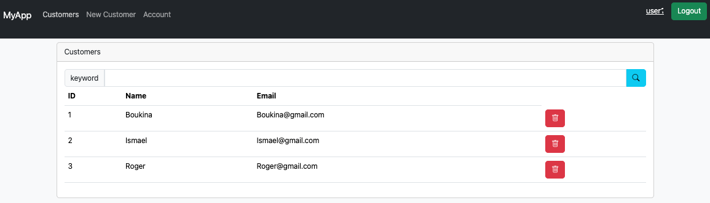

# Partie 3 : Sécuriser l'application avec un système d'authentification basé sur Spring Security et Json Web Token
- spring security 7 + SPring Boot 4
- JWT (Json Web Token)
- Authentification stateless
- base 64 Helper intellij plugging
- Http Client intellij plugging 

### Basic Authentication
- 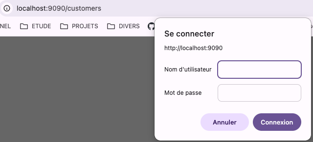
- 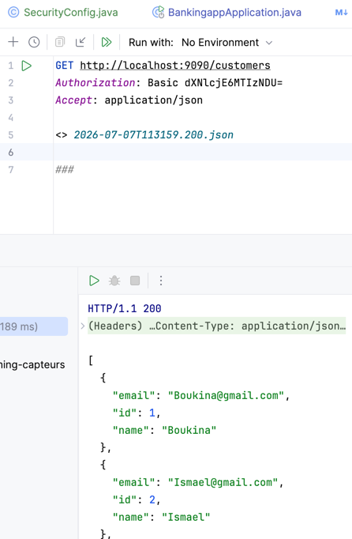

### Jwt authentication
- 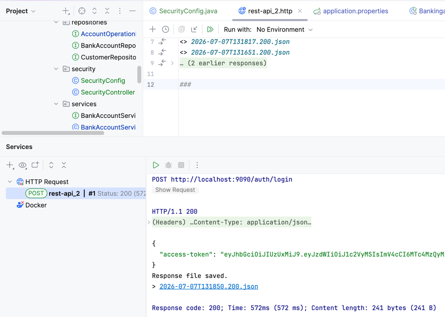
  Jwt Token Signature
- 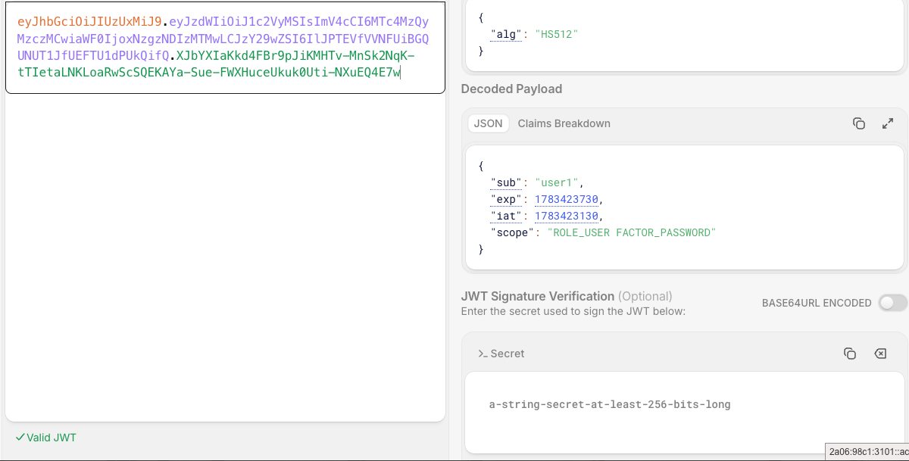
- 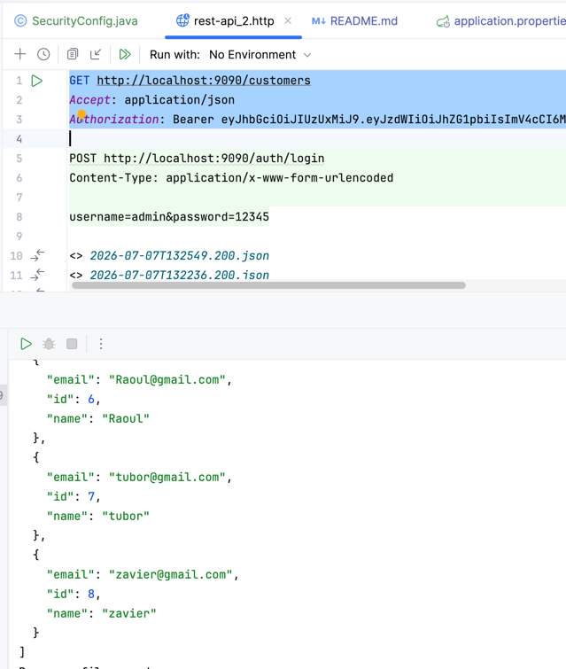
- npm install jwt-decode

#### Authentication
 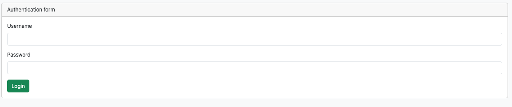

#### admin login 
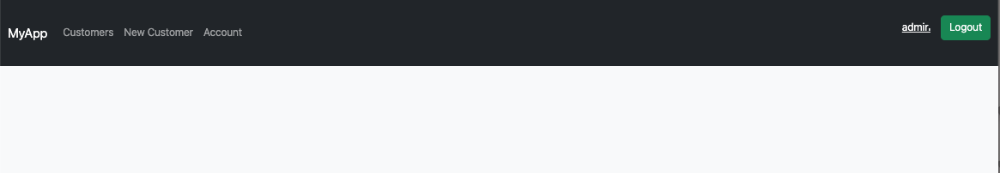

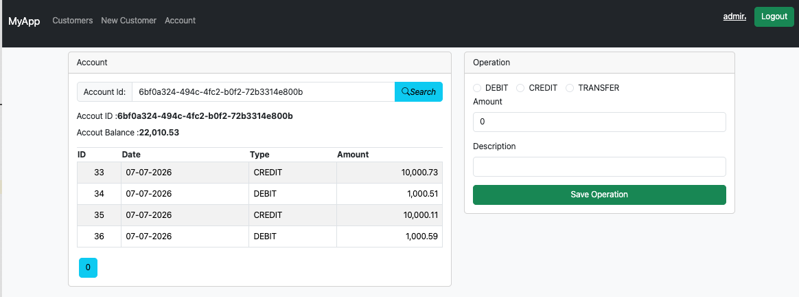

#### user profile login 
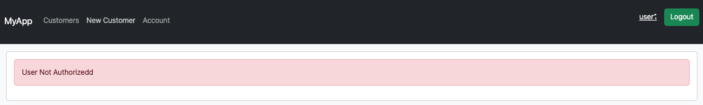

# Partie 4 : Chat BOT AI

